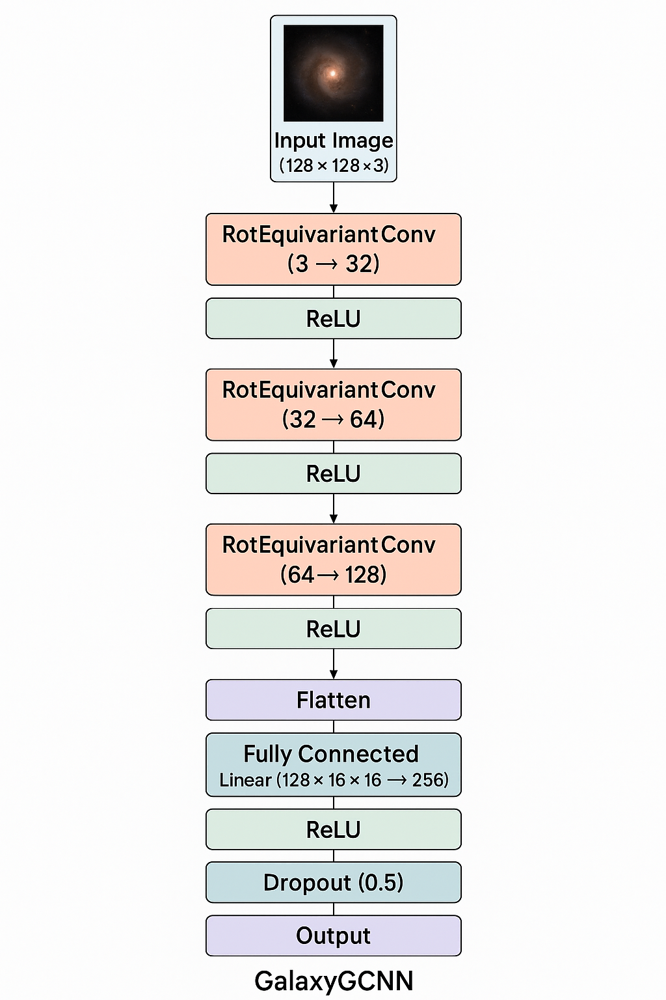
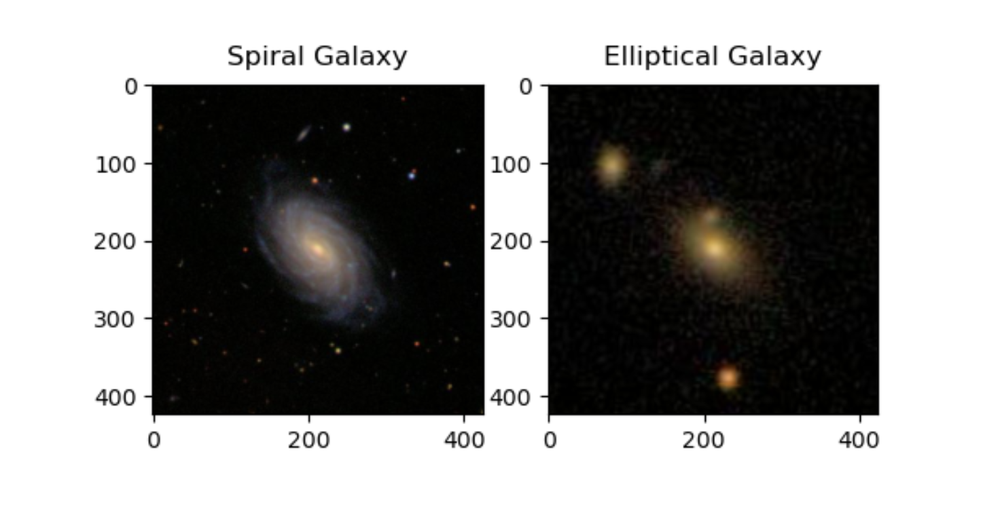

# Rotation-Equivariant Neural Networks for Galaxy Morphology Classification

## Problem Description  
Classifying galaxies based on their morphology (e.g., spiral, elliptical, irregular) is a fundamental task in astrophysics. Understanding galaxy morphology helps astronomers study galaxy formation, evolution, and large-scale structure in the universe. However, one of the biggest challenges in galaxy classification is the **arbitrary orientation** of galaxies in telescope images. Traditional Convolutional Neural Networks (CNNs) struggle with rotational variations, requiring extensive data augmentation to compensate for different orientations.  

This project aims to develop a **Group Equivariant CNN (G-CNN)** that naturally incorporates rotation equivariance, allowing the model to classify galaxies more accurately without requiring excessive training data augmentation. By leveraging the mathematical properties of equivariant neural networks, the model will be able to recognize features of spiral galaxies regardless of their orientation, leading to more efficient and robust classification.  

## Problem Formulation (Input-Output Statement)  
- **Input**: An image of a galaxy, taken from a telescope survey. The galaxy may appear at any arbitrary rotation.  
- **Output**: Classfying Galaxy images into following catogeries.  
  - 'Spiral galaxy'  
  - 'Elliptical galaxy'  

The model will be designed to generalize across different galaxy sizes, brightness levels, and noise variations in astronomical images.  

## Data Source  
The dataset for this project will be sourced from **Galaxy Zoo**, a citizen science project providing labeled galaxy images from the Sloan Digital Sky Survey (SDSS).  

### Downloading the Galaxy Zoo Dataset  
1. **Dataset Link**: [Galaxy Zoo Data Releases](https://www.zooniverse.org/projects/zookeeper/galaxy-zoo/data)  
2. **Changes Incoorporated in the Galazy Zonn Dataset**:  
   - Downladed the Dataset
   - Selected the good data from the dataset using foollowing code: 
    ```python
    data = pd.read_csv('training_solutions_rev1.csv')
    def append_ext(filename):
        return f"{filename}.jpg"

    data["GalaxyID"] = data["GalaxyID"].apply(append_ext)

    new_data = data[((data["Class1.1"] >= .8) | (data["Class1.2"] >= .8))].reset_index(drop=True)
    new_data.drop_duplicates(inplace=True)
    new_data.isnull().sum().sum()

    conditions = [new_data["Class1.1"] >= 0.9, 
                new_data["Class1.2"] >= 0.9]

    choices = ["elliptical", "spiral"]

    new_data["class"] = np.select(conditions, choices, default="Tie")

    data.sort_values("Class1.3", 
                    ascending=False,
                    inplace=True)

    df_antifacts = data[data["Class1.3"] >= .5 ]

    df_spiral_new = new_data[new_data["class"] == "spiral"].sample(n=2000)


    df_elliptical_new =new_data[new_data["class"] == "elliptical"].sample(n=2000)


    frames = [df_spiral_new, df_elliptical_new]
    df_galaxies = pd.concat(frames)
    df_galaxies = df_galaxies[["GalaxyID", "class"]]
    df_galaxies.to_csv("galaxies.csv", index=False)
    ```
    - Now, we will have 2000 spiral and 2000 elleptical galaxies for the model to train on 

## Choice of Model Architecture  
The model will be based on a Group Equivariant CNN (G-CNN), which extend standard CNNs by ensuring that learned features remain consistent under rotations. [Group Equivariant Convolutional Networks](https://arxiv.org/abs/1602.07576) is the basis of my architecture. I will be implementing a convolutional neural network with rotation equivariance in 2D by training each convolutional kernel over various rotational orientations. The key reasons for choosing this model are:  
- **Rotation Equivariance**: G-CNNs naturally account for rotations using mathematically structured filters.  
- **Reduced Need for Augmentation**: G-CNNs eliminate this need by inherently learning rotation-invariant features.  
- **Improved Generalization**: The model is expected to perform better on unseen galaxy orientations.  

 
## Architecture Details:


*Figure 1: Model Architecture
### Convolutional Block:

3 rotation-equivariant convolutional layers Channel dimensions: 3 → 32 → 64 → 128Each followed by ReLU activation and 2×2 max-pooling
Progressive downsampling (128×128 → 16×16 feature maps)

### Classification Head:

Flattened features → 256-unit dense layerDropout for regularization (p=0.5)Final 2-unit output (binary classification)
## Example Galaxy Image  
Below is an example of a Spiral galaxy and Elleptical galaxy from the SDSS survey:  

  
*Figure 2: A spiral galaxy  and Elleptical Galaxy*  
